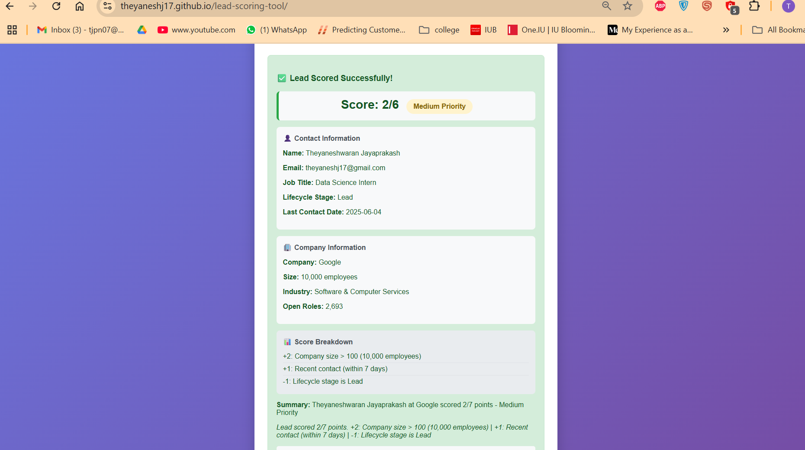

# 🔍 Lead Scoring Workflow (n8n + MCP)

This project implements a dynamic lead scoring system using the **n8n automation platform** and **MCP (Model Context Protocol)** to integrate real-time data from HubSpot, BigPicture API, and Adzuna. A lightweight frontend built using HTML is hosted on GitHub Pages for live testing.

---

## 🚀 Live Demo

👉 Try the scoring tool: [https://theyaneshj17.github.io/lead-scoring-tool/](https://theyaneshj17.github.io/lead-scoring-tool/)

---

## 🧠 Project Architecture

The workflow performs the following steps:

1. **Trigger Input**
   - Starts from an email submitted via the GitHub Pages form.
   - This triggers a webhook in n8n.

2. **Contact Details (HubSpot via MCP)**
   - Retrieves contact details (name, title, company, last activity, stage) using MCP from HubSpot.
   - Example node: `Get Contact Details (MCP Pipedream→HubSpot)`

3. **Company Metadata (BigPicture API)**
   - Uses the company name to fetch its domain.
   - Then fetches company metadata: size, industry, type.

4. **Open Roles (Adzuna API)**
   - Queries Adzuna using the domain to get current job openings count.

5. **Score Calculation (JavaScript)**
   - Score is computed based on:
     - +3 if title includes "VP" or "Director"
     - +2 if company size > 100
     - +1 if contact date is within 7 days
     - -1 if lifecycle stage is still "Lead"

6. **Final Output**
   - The result is merged and returned as a JSON response via `Respond to Webhook`.
   - The frontend UI displays the score, contact details, and explanation.

---

## 📊 Sample Results

### ⚠️ Theyaneshwaran Jayaprakash (Intern, Google)
- Score: **2/6** – Medium Priority
- 

---

## 🛠️ Files in This Repository

| File Name         | Description                            |
|-------------------|----------------------------------------|
| `index.html`      | Frontend form for email input          |
| `WorkFlow.json`   | Exported n8n workflow                  |
| `WorkFlow.pdf`    | PDF visualization of the flow          |
| `N8n.png`         | Screenshot of the full workflow        |
| `UI1.png`         | Screenshot of the frontend interface   |
| `scoreX_*.png`    | Output examples for scored leads       |
| `README.md`       | This documentation                    |

---

## 📦 Technologies Used

- **n8n**: Workflow orchestration
- **HubSpot + MCP**: Contact data API
- **BigPicture API**: Company metadata
- **Adzuna API**: Open roles count
- **JavaScript**: Scoring logic
- **HTML/CSS**: GitHub Pages UI

---

## 📬 Contact

Created by Theyaneshwaran Jayaprakash \
✉️ [theyaneshj17@gmail.com](mailto:theyaneshj17@gmail.com)

⚠️ **Disclaimer**: All contact and company records shown in this project are dummy/test data used solely for demonstration purposes. No real personal or proprietary information is stored or shared.

